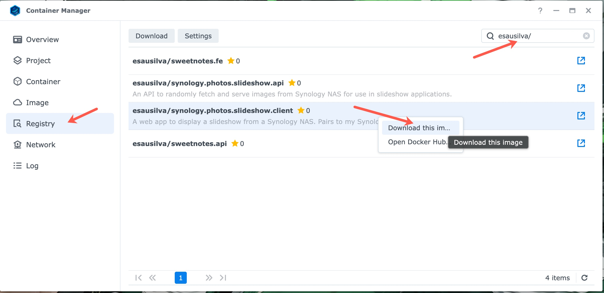
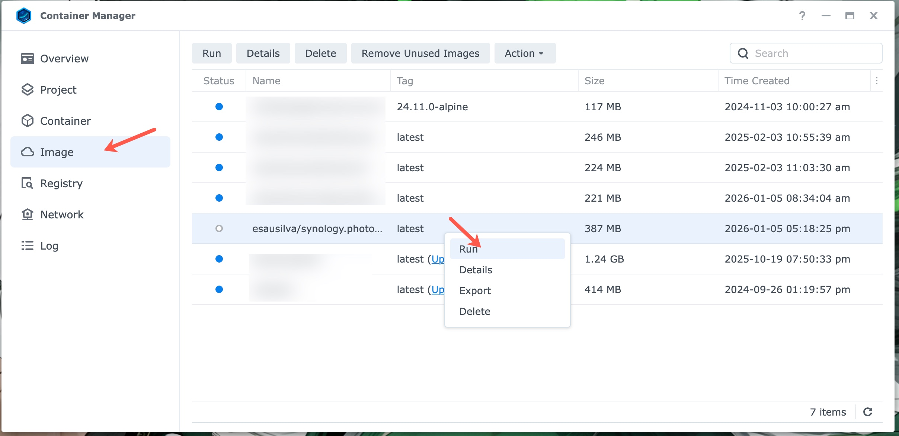

# Synology Photos Slideshow Client

> A web application designed to display image slideshows sourced from a Synology NAS. Built to pair seamlessly with my [Synology Photos Slideshow API](https://github.com/esausilva/synology-photos-slideshow-api).

Below you can take a look at the slideshow in action.

<div align="center">


</div>

_Photos in the above animation come from [Lorem Picsum](https://picsum.photos/), and the animation is sped up to 2x for a faster preview._

The slideshow is an MVP with minimal features for now. Upon loading, the slideshow will set a default interval of 20 seconds and a random display order. These settings can be changed by clicking on the slider icon in the top right corner of the slideshow.

Since the app persists settings in the browser's IndexedDB, they will not be preserved across different devices. I might introduce a centralized database to persist settings across devices in the future.

To get slideshow images for the first time or to refresh the images, press the "Refresh Photos" button on the settings page. This will delete the current set of images and fetch new ones from the Synology NAS.

The slideshow is meant to be deployed on a Synology NAS device on your local network and accessed from within your local network.

I have the app deployed and tested in Synology Container Manager, but it should work on any Docker host. i.e. Portainer.

Table of Contents:

- [Technical Details](#technical-details)
- [Local Development](#local-development)
- [Local Testing with Docker](#local-testing-with-docker)
- [Deployment To Your Synology NAS Device](#deployment-to-your-synology-nas-device)
- [Important !!!!!!!](#important)
- [Future Enhancements](#future-enhancements)
- [Giving Back](#giving-back)

## Technical Details

The app calls different endpoints from my [Synology Photos Slideshow API](https://github.com/esausilva/synology-photos-slideshow-api) to fetch, serve and download the slideshow images. 

API's endpoints:

- [Get Photo URLs](https://github.com/esausilva/synology-photos-slideshow-api#get-photo-urls): This endpoint returns a list of photo URLs that can be used in a client slideshow application.
- [Download Photos](https://github.com/esausilva/synology-photos-slideshow-api#download-photos): This endpoint randomly selects and downloads photos from a specified folder(s) on your Synology NAS device. The downloads are placed in a specified folder where the API has access to.

Refer to the API's documentation for more details.

## Local Development

Get the [Synology Photos Slideshow API](https://github.com/esausilva/synology-photos-slideshow-api) up and running first, either locally/Docker or on your Synology NAS.

You will need Node and TypeScript installed on your machine. I use `pnpm` as my package manager and have included the `pnpm-lock.yaml` file. But feel free to use whatever package manager you prefer.

- `pnpm install` to install the dependencies.
- `pnpm dev` to start the development server.
- `pnpm build` to build the app for production.
- `pnpm preview` to preview the production build.
- `SERVER__API_BASE_URL=http://localhost:5097 CLIENT__API_BASE_URL=http://localhost:5097 pnpm start` to start the production build. We need to include the API URLs in the environment variables for the app to work with the `start` script. The default port for the API is `5097`.

The `.env` file has two environment variables:

- `SERVER__API_BASE_URL`: The base URL of the Synology Photos Slideshow API. Server functions (SSR) use this URL.
- `CLIENT__API_BASE_URL`: The base URL of the Synology Photos Slideshow API. The web client app uses this URL.

Update the `.env` file with the correct API URL and port. The API URL will either be `localhost` or the IP address of your Synology NAS. The default port for the API is `5097`.

Running locally (non-Docker), both environment variables in the `.env` file will be the same.

The slideshow will be available at `http://localhost:3500`.

## Local Testing with Docker

The reason there are two environment variables for technically the same API is because when running the API in Docker locally, the server functions (_client_ SSR) need to access the internal Docker network from the API's container.

Notice the extra hosts in the `docker-compose.yaml` file: `host.docker.internal:host-gateway`. Then the `docker-compose.local.yaml` file has the `SERVER__API_BASE_URL` environment variable set to `http://host.docker.internal:5097`. The client can access the API via `localhost`.

To build the image, run the following command:

```bash
docker-compose -f docker-compose.yaml -f docker-compose.local.yaml build
```

To create the container and start it, run the following command:

```bash
docker-compose -f docker-compose.yaml -f docker-compose.local.yaml up -d
```
`-d` is optional if you want to run the container as a detached (background) process.

Note: It would be a good idea to rename the image in both Docker compose files and remove my name from the image name.

The default port of the production build is `3000`, so the Docker Compose file will map that port to `3500`.

The slideshow will be available at `http://localhost:3500`.

## Deployment To Your Synology NAS Device

Two options:

1. Download the latest image from my Docker Hub Repo: [esausilva/synology.photos.slideshow.client](https://hub.docker.com/r/esausilva/synology.photos.slideshow.client).
2. Build the image yourself and push it to your own Docker Hub repository. Following this route, you will need to rename the image to match your repository in the `docker-compose.yml` file.


**For option 2:**

Run the following command to build the image:

```bash
docker-compose build
```

This will take the default docker compose file, `docker-compose.yaml`, and build the image, skipping the local docker compose file, `docker-compose.local.yml`.

Run the following command to push the image to your Docker Hub repository:

```bash
docker push [your-repo]/synology.photos.slideshow.client:latest
```

**For both options:**

From Synology Container Manager, click on the "Registry" tab and search for the appropriate repository and image.

Right-click on the image and select "Download this image".



Once the image is downloaded, you can create a container from it by going to the "Image" tab, then right-clicking on the image and selecting "Run".



From there, you can configure the container. In the first screen you will need to set the container name, I would suggest checking-off the "Enable auto-restart" option.

On the second screen, configure the local (to the NAS) ports. Make sure you map the ports correctly to `3500:3000`. `3500` being the port on the NAS device, but you can choose whatever you want for this port.

Finally, you need to configure the environment variables under the "Environment" heading.

The environment variables will be as follows:

| **Environment Variable** | **Value**                 |
|--------------------------|---------------------------|
| SERVER__API_BASE_URL     | http://[YOUR-NAS-IP]:5097 |
| CLIENT__API_BASE_URL     | http://[YOUR-NAS-IP]:5097 |

Make sure you replace `[YOUR-NAS-IP]` with the IP address of your Synology NAS.

The slideshow will be available at `http://[YOUR-NAS-IP]:3500`.

## Important !!!!!!!

I highly suggest you create a DHCP reservation in your router for the IP address of your Synology NAS device.

This will make the IP predictable and not change every time your NAS restarts, or DHCP assigns a new IP address.

## Future Enhancements

To support the API's [Future Enhancements](https://github.com/esausilva/synology-photos-slideshow-api?tab=readme-ov-file#future-enhancements)

| Feature                  | Description                                                                                     | Satatus |
|:-------------------------|:------------------------------------------------------------------------------------------------|:--------|
| **Manual Delete Button** | Adds a UI button to remove the currently displayed photo from the local rotation.               | ✅      |
| **Metadata Overlay**     | Displays photo details like date and location with potential Google Maps links.                 |         |
| **Download Settings**    | A configuration menu to set the number of photos to download.                                   |         |
| **Gallery View**         | A new page displaying all photos in a gallery format and the ability to delete multiple photos. |         |

What else? Will see...

## Giving Back

If you find this project useful in any way, consider getting me a coffee by clicking on the image below. I would really appreciate it!

[](https://www.buymeacoffee.com/esausilva)
