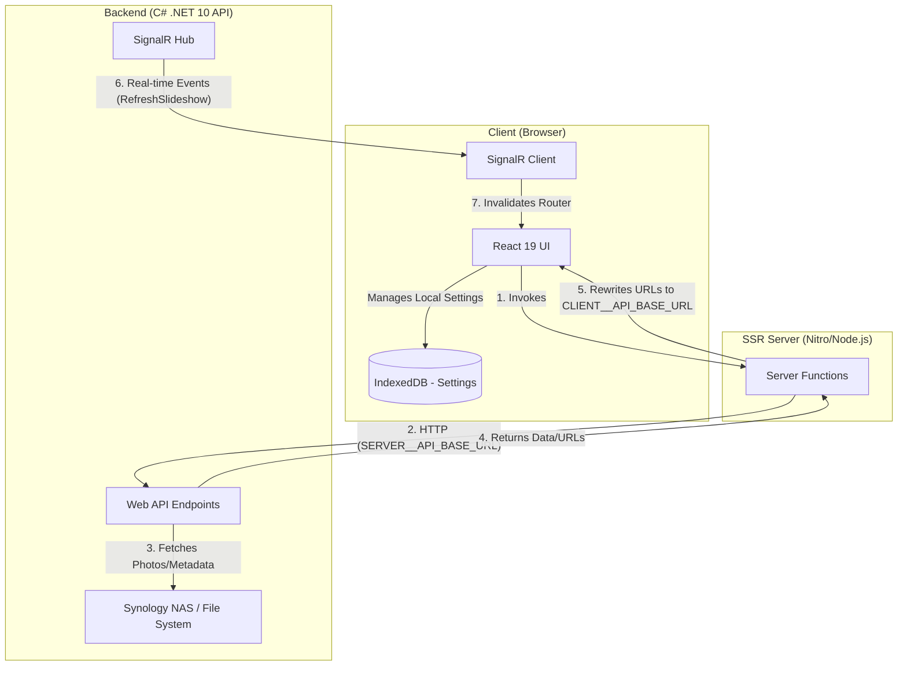

# Architecture Overview

This document provides a high-level overview of the `synology-photos-slideshow-client` architecture and its interaction with the Synology Photos Slideshow API.

## System Architecture

The client is built using **TanStack Start**, which provides a full-stack React framework with Server-Side Rendering (SSR) capabilities powered by Vite and Nitro.

## Key Components

### 1. React Frontend (React 19 + TypeScript)
- **TanStack Router**: Handles file-based routing and loaders.
- **Components**: Modular React components for the slideshow, gallery, and settings.
- **SignalR Hook**: `useSlideshowSignalR` manages the connection to the backend hub and triggers UI refreshes when data changes on the server.

### 2. SSR Server (Nitro)
- **Server Functions**: Located in `src/server-functions/index.ts`. These functions run on the server side (Node.js) to bridge the gap between the browser and the C# API.
- **Environment Variables**:
    - `SERVER__API_BASE_URL`: Used by Nitro to communicate with the API within the internal network (e.g., Docker).
    - `CLIENT__API_BASE_URL`: Sent to the browser so it can correctly reference images and SignalR.

### 3. Data Flow & Rendering
- **Deferred Loading**: Routes use `defer()` to ensure the initial HTML shell is sent quickly, with data streaming in as the server functions resolve.
- **URL Transformation**: The server functions rewrite relative image paths from the API into full URLs using the `CLIENT__API_BASE_URL` to ensure the browser can reach the assets.

### 4. Client-Side Persistence
- **IndexedDB**: Slideshow settings (interval, random order, overlay visibility) are persisted locally in the browser's IndexedDB, ensuring they remain consistent across page reloads on the same device.

### 5. Real-Time Updates
- **SignalR**: The client listens for events like `RefreshSlideshow` and `RefreshGallery`. When received, the TanStack Router cache is invalidated, causing the loaders to refetch the latest data from the server.
